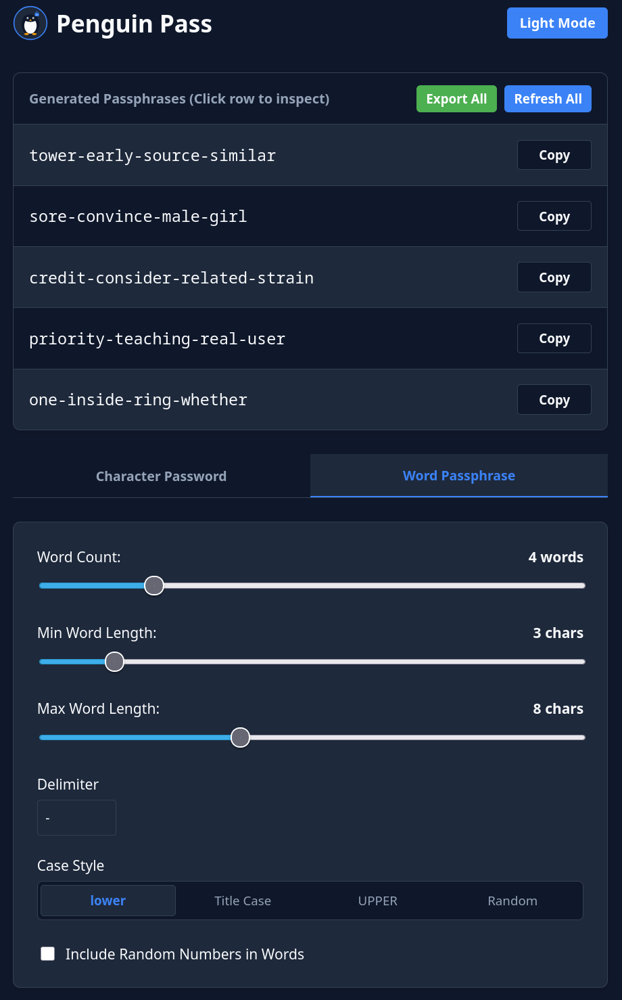
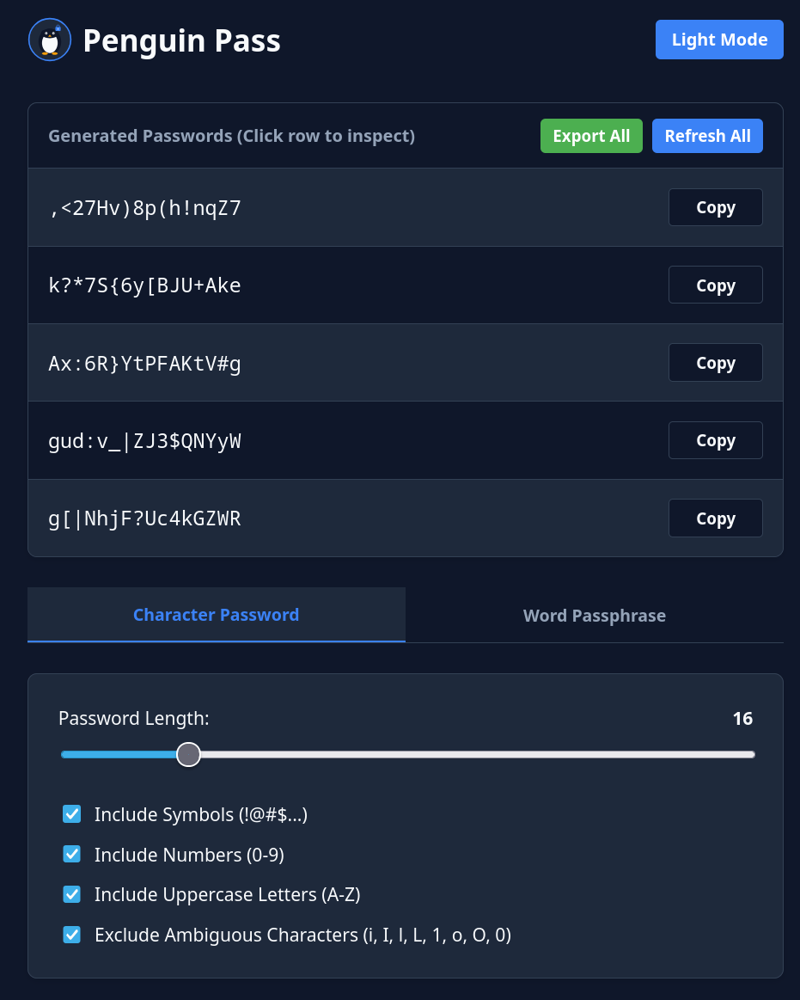
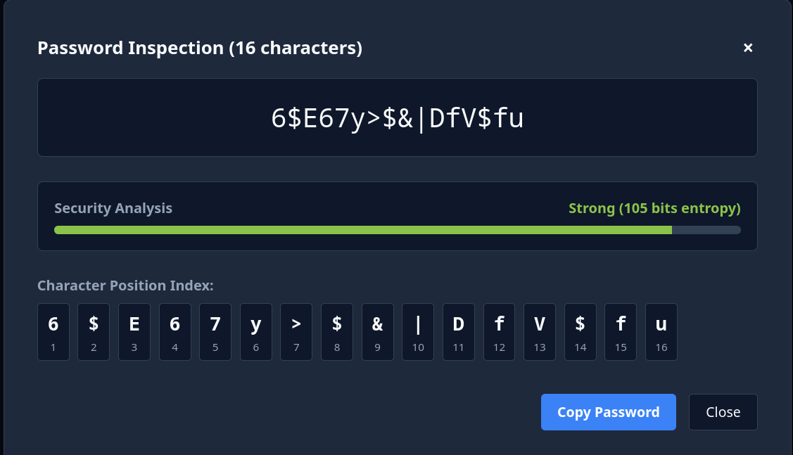

# Penguin Pass

A modern web application for generating secure character passwords and word passphrases, built with a secure backend and responsive frontend.

<p align="left">
  
  
  
</p>

## Features

* **Cryptographically Secure**: Utilizes Python's secure `secrets` module for high-entropy random generation.
* **Character Passwords**: Generate custom-length passwords (6 to 64 characters) with options to include symbols, numbers, uppercase letters, and a filter to **exclude ambiguous characters** (such as `i`, `I`, `l`, `L`, `1`, `o`, `O`, `0`).
* **Word Passphrases**: Generate secure, dictionary-based passphrases from a curated list of 3,000 common English words, featuring adjustable word counts, length filters, custom delimiters, and optional random numbers.
* **Password Inspection Modal**: Click on any generated password row to open an inspection window that displays the full text along with precise character position indices underneath.
* **Theme Support**: Toggle seamlessly between Light Mode and Dark Mode, with automatic fallback to your system preferences.

## Tech Stack

* **Frontend**: React 18, Vite
* **Backend**: Python, FastAPI, Uvicorn
* **Deployment**: Docker & Docker Compose (with Traefik reverse proxy and Homepage integration support)

## Running with Docker

### Standalone Docker CLI

To run a standalone container directly using the Docker CLI and mapping port `8080` to the internal port `8000`:

```bash
docker run -d \
  --name penguin-pass \
  -p 8080:8000 \
  --restart unless-stopped \
  mmozzano/penguin-pass:latest

```

### Docker Compose
To run a standalone container using Docker Compose and mapping port `8080` to the internal port `8000`:

```yaml
services:
  penguin-pass:
    image: mmozzano/penguin-pass:latest
    ports:
      - "8080:8000"
    restart: unless-stopped

```

### Docker Compose (with Traefik and Homepage labels)

To run a standalone container using Docker Compose with Traefik routing and Homepage labels enabled:

```yaml
services:
  penguin-pass:
    image: mmozzano/penguin-pass:latest
    restart: unless-stopped
    container_name: ${SERVICE}
    networks:
      - traefik_default
    labels:
      - "traefik.enable=true"
      - "traefik.http.routers.${SERVICE}.entrypoints=web, websecure"
      - "traefik.http.routers.${SERVICE}.rule=Host(`${SERVICE}.${DOMAIN}`)"
      - "traefik.http.routers.${SERVICE}.tls=true"
      - "traefik.http.routers.${SERVICE}.tls.certresolver=cloudflare"
      - "traefik.http.routers.${SERVICE}.service=${SERVICE}"
      - "traefik.http.services.${SERVICE}.loadbalancer.server.port=8000"
      - "traefik.docker.network=traefik_default"
      - "traefik.http.routers.${SERVICE}.middlewares=secured@file"
      - homepage.group=${GROUP}
      - homepage.name=${SERVICE_NAME}
      - homepage.icon=passwork.png
      - homepage.href=https://${SERVICE}.${DOMAIN}/
      - homepage.description=${DESCRIPTION}

networks:
  traefik_default:
    external: true

```

## Configuration (`.env`)

Configure your environment variables using the following template:

```env
DOMAIN=yourdomain.com
SERVICE=pass
SERVICE_NAME=Penguin Pass
GROUP=Applications
DESCRIPTION=Password Generator

```
